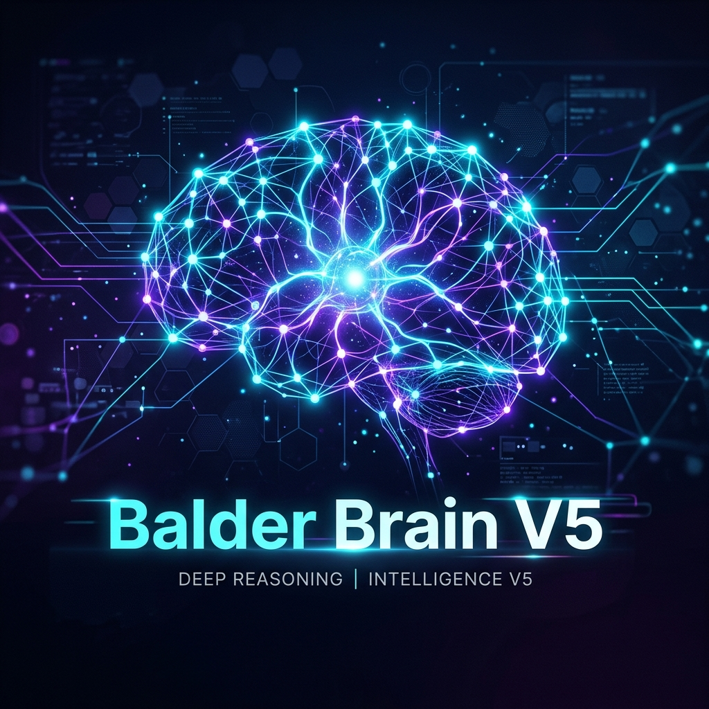

<p align="center">
  
</p>

<h1 align="center">🧠 Balder Brain V5</h1>

<p align="center">
  <strong>Advanced Intent Recognition & Behavioral Control for Small LLMs</strong>
</p>

<p align="center">
  <strong>Author:</strong> Vietnamese AI Researcher (Viber Việt)
</p>

<p align="center">
  
  
  
</p>

---

## 🌟 Overview

**Balder Brain V5** is a research-driven orchestration framework designed to maximize the performance of small Large Language Models (LLMs), specifically the **Gemma 4** series (2B, 4B, and 26B). 

While small models often suffer from **Behavioral Hallucination**—misinterpreting user intent or triggering incorrect actions—Balder V5 introduces a multi-layered reasoning architecture that achieves up to **93.8% accuracy** on complex agentic tasks using only a 4B parameter model.

> [!IMPORTANT]
> **[Read the Full Research Report Here →](RESEARCH_REPORT.md)**

## 🚀 Key Features

- **🛡️ Behavioral Safety Gates**: Prevents unauthorized or dangerous actions regardless of model output.
- **📦 Capsule Text Compression**: Normalizes context to reduce cognitive load on small models.
- **⚡ Three-Tier Inference**: Separates fast keyword recognition from deep semantic routing and safety validation.
- **🤔 Ambiguity Ask-Back**: A built-in mechanism that forces the model to ask for clarification rather than guessing.
- **📊 Multi-Factor Scoring**: Combines semantic similarity, keyword weight, and risk assessment for high-precision routing.

---

## 📖 Research Report: Reducing Behavioral Hallucination

### 1. Executive Summary
During experiments with locally-hosted LLMs, we observed that the primary failure mode for small models in agentic workflows is not factual errors, but **intent misinterpretation**. Balder V5 addresses this by wrapping the model in a controlled reasoning pipeline.

### 2. Experimental Results (Gemma 4 Series)

| Version | Model | Avg. Score | Safety Rate |
| :--- | :--- | :--- | :--- |
| V1 | Rule-based | 77.1% | 100% |
| V3 | 26B (Optimized) | 77.1% | 100% |
| V4 | 2B (Optimized) | 87.5% | 100% |
| **V5** | **Gemma 4 4B** | **93.8%** | **100%** |

*Conclusion: The 4B model provides the optimal balance of instruction-following and stability when supported by the V5 architecture.*

### 3. The Architecture
The framework transitions from rigid "if-else" logic to a "soft" mathematical router using:
- **Cosine Similarity**: For semantic matching.
- **Bayesian Inference**: To update intent confidence based on user feedback.
- **Graph Reasoning**: To map multi-step dependencies.

---

## 🛠️ Installation

1. **Clone the repository**:
   ```bash
   git clone https://github.com/YOUR_USERNAME/balder-brain-v5.git
   cd balder-brain-v5
   ```

2. **Install dependencies**:
   ```bash
   pip install -r requirements.txt
   ```

3. **Configure Environment**:
   Create a `.env` file based on the provided logic (do not share your API keys!).

---

## 📂 Project Structure

```text
├── Core/               # Core reasoning logic (Agent, Router, Safety)
├── src/                # Source code and utility scripts
├── docs/               # Detailed documentation and research data
├── tests/              # 40+ Test cases for benchmarking
└── README.md           # This file
```

---

## 🤝 Contributing

Contributions are welcome! If you find a bug or have an idea for a new feature, please open an issue or submit a pull request. We are particularly interested in:
- New test scenarios for the Comparison module.
- Optimization for ultra-low latency environments.

## 📄 License

This project is licensed under the MIT License - see the [LICENSE](LICENSE) file for details.

---

<p align="center">
  Built with ❤️ for the Open Source AI Community
</p>
